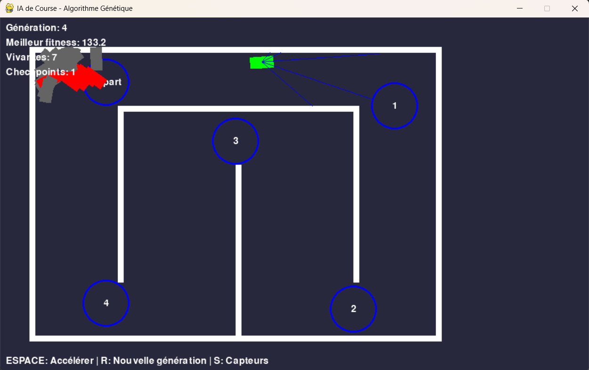
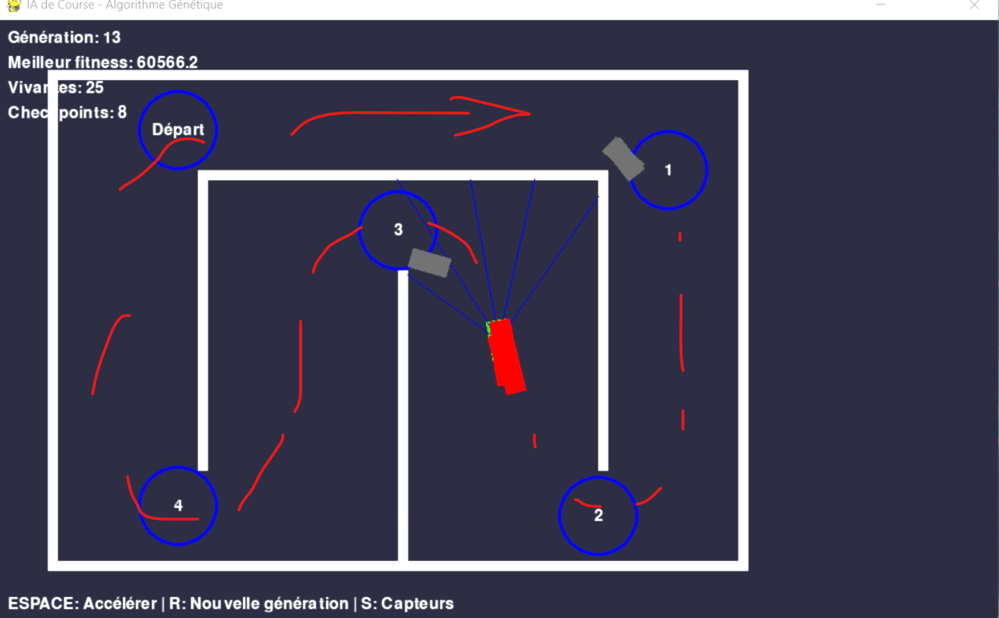

#🚗 Driving AI with NEAT (NeuroEvolution)
This project showcases an AI that learns to drive a car in a 2D environment using the NEAT algorithm (NeuroEvolution of Augmenting Topologies). No hardcoded pathfinding — the agent evolves behaviors through generations, mutation, and selection. 🧬

#🧠 What It Does
🎮 The AI controls a car in a simple 2D driving simulation with checkpoints built with Pygame.

🧬 It learns using NEAT: networks are evaluated based on how far and how safely they drive.

👁️ A visual interface displays the car in action as it learns and improves over generations.

#🚀 Features
# 🚀 Features
  🔄 No supervised learning – only evolution by fitness

  🧠 Networks evolve topologies and weights

  📊 Real-time simulation with visualization

  🏆 Tracks best fitness, average scores, and generation progress

Here is an image of what it looks like :

There is sevral cars for a generation and we select the best. (Grays had hit a wall, reds are normal and the green is the best of this generation)

# 📦 Dependencies
  Python 3.x 🐍
  any lib : this time, I don't use neat-python for neuroevolution
  pygame for visualization 🎮

#📝 Notes & Observations
⏳ Like any evolutionary approach, early generations perform terribly — driving in circles or crashing instantly — but over time, the network learns basic control and navigation.

Here, we can see that over 13 generations, the best path have been found (in less than 5 min). So, it is really quick !
